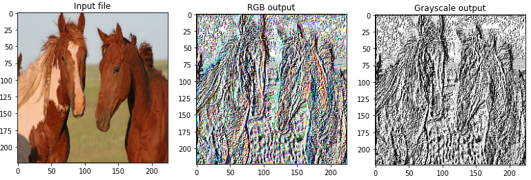
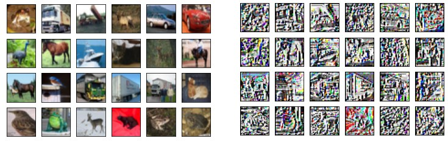

# Fast Local Binary Patterns using TensorFlow

# Processing Cifar10 dataset with LBP:

# **[lbp_notebook.ipynb](lbp_notebook.ipynb)** 

# [LDP processing of Cifar10:](https://github.com/dwday/deep-learning-ldp-layer)
[A custom TensorFlow layer for local derivative patterns](https://github.com/dwday/deep-learning-ldp-layer)

### Please cite below works if you find it useful:
[Akgun, D., A TensorFlow implementation of Local Binary Patterns Transform. MANAS Journal of Engineering, 9(1), 15-21. DOI:10.51354/mjen.822630](https://www.researchgate.net/publication/363250644_A_TensorFlow_implementation_of_Local_Binary_Patterns_Transform)

### LBP Pytorch implementation:

[Akgun, Devrim. "A PyTorch Operations Based Approach for Computing Local Binary Patterns." U. Porto Journal of Engineering 7.4 (2021): 61-69. https://doi.org/10.24840/2183-6493_007.004_0005 ](https://www.researchgate.net/publication/356572689_PyTorch_Operations_Based_Approach_for_Computing_Local_Binary_Patterns)

### LDP using TensorFlow:

[Akgün, D. "A TensorFlow based method for local derivative pattern." Mugla Journal of Science and Technology 7.1 (2021): 59-64. DOI:10.22531/muglajsci.830691](https://www.researchgate.net/publication/349905348_TensorFlow_Accelerated_Feature_Extraction_Using_Local_Derivative_Pattern)
