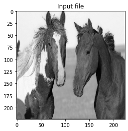
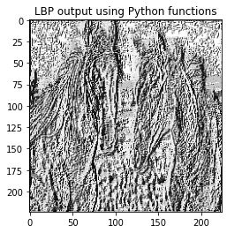
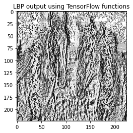

# Fast Local Binary Patterns using TensorFlow
The file lbp_tf.py explains an example of implementing local binary patterns using an input with random numbers. The size of the input can be changed to see the effect on the computation time.

Example application:

```python

    from keras.preprocessing import image
    import matplotlib.pyplot as plt
    
    # put your test image here
    path='ILSVRC2012_test_00000689.jpg'
    
    img_org =image.load_img(path,target_size=(224,224,1),color_mode='grayscale')
    img_org=image.img_to_array(img_org)
    [Rows,Cols,nChannel]=img_org.shape
    
    # Test TensorFlow
    start_time = time.time()
    yTf        = tf_lbp(img_org.reshape(1,Rows,Cols).astype('uint8')).numpy()
    elapsed_tf = time.time() - start_time
    
    # Test Python implementation 
    start_time= time.time()    
    yPy       =lbp_python(img_org[:,:,0].astype('uint8'))
    elapsed_py= time.time() - start_time    
    
    # Elapsed times
    print('python elapsed_time=',elapsed_py)
    print('tensor flow elapsed_time=',elapsed_tf)  
    
    # Show input and output images
    plt.figure(1)
    plt.imshow(img_org,cmap='gray' )
    plt.title('Input file')    
    plt.figure(2)
    plt.imshow(yPy ,cmap='gray' )
    plt.title('LBP output using Python functions')
    plt.figure(3)
    plt.imshow(yTf.reshape(Rows,Cols,1) ,cmap='gray' )
    plt.title('LBP output using TensorFlow functions') 
```
Console output:
```python
# First try
python elapsed_time= 1.0810394287109375
tensor flow elapsed_time= 0.35726308822631836
# Second try
python elapsed_time= 1.086390495300293
tensor flow elapsed_time= 0.011996269226074219
```
Input image:




LBP using python:




LBP using Tensorflow:




Reference:

AKGÜN, D. A TensorFlow implementation of Local Binary Patterns Transform. MANAS Journal of Engineering, 9(1), 15-21.  
